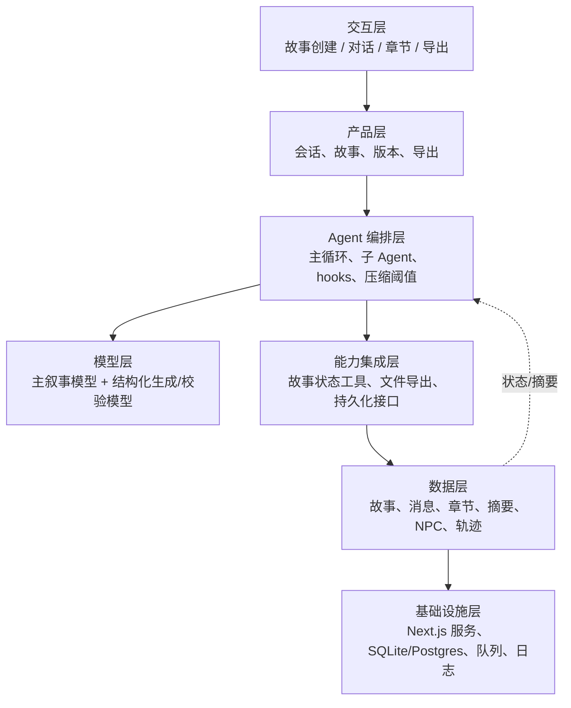

# 写作陪伴助手：架构方案

## 目标与核心闭环

用户输入故事方向与偏好 → 故事框架 Agent 生成世界观草案 → NPC Agent 生成主要角色卡 → 用户确认/修改 → 主叙事 Agent 根据用户每轮输入推进剧情 → 对话记录持续写入剧本 → 上下文达到阈值时由章节 Agent 生成章节并归档 → 摘要 Agent 更新上一章摘要与长期故事状态。

成功标准：用户可以创建故事、确认世界观和角色、连续推进剧情，并随时导出结构化剧本；上下文压缩后人物设定、关键事实和未解决伏笔不丢失。

## 待确认产品决策

- 模型供应商与默认模型：待确认。
- 交互形态：现有 Next.js Web 项目可作为默认，移动端/API 为后续选项。
- 是否允许成人、暴力、现实人物等内容：待确认；默认启用内容安全策略。
- 剧本导出格式：Markdown 为默认，DOCX/PDF 是否需要待确认。
- 单用户本地使用还是多用户账号与云端同步：待确认。
- 上下文窗口与阈值：默认在 50% 提示存档、80% 自动压缩、95% 强制归档；具体 token 数依模型配置动态计算。

## Harness 五要素

**工具**：创建故事、更新世界观、管理 NPC、追加对话、生成章节、压缩摘要、读取故事状态、导出剧本。

**知识**：世界观 schema、角色卡 schema、时间线/伏笔规则、叙事风格规则、内容安全规则、剧本格式规范。

**观察**：上下文 token 使用率、章节状态、未解决伏笔、角色一致性检查、工具调用轨迹、归档成功状态。

**行动**：主 Agent 回复、调用四类专用 Agent、写入数据库/文件、触发通知、导出文件。

**权限**：用户只能访问自己的故事；自动归档可写入故事数据；导出与删除需用户主动操作；模型不能执行外部系统副作用。

## Agent 分工

1. **故事框架 Agent**：根据用户输入和弱引导选项生成时代、地理、力量体系、冲突主线、叙事基调和初始大纲；输出结构化 JSON + 面向用户的说明。
2. **NPC Agent**：生成主要 NPC 的身份、欲望、恐惧、秘密、关系、说话风格、成长弧线和出场条件；支持单独重写某个角色。
3. **主叙事 Agent**：维护用户作为作者/玩家的控制权；每轮只推进合理范围，遇到关键分岔提供选择但接受自由输入；引用权威故事状态避免设定漂移。
4. **章节与摘要 Agent**：在阈值触发时把对话整理为章节，提取事实、时间线、角色状态、伏笔和待解决冲突，更新压缩上下文。

## 七层架构

## 上下文与存档策略

- 每轮消息写入 `conversation_messages`，同时维护可重建的 `story_state`。
- 50%：前端提示“建议存档”，不打断对话。
- 80%：后台触发章节 Agent，生成草稿章节和压缩摘要；完成后更新上下文。
- 95%：阻止继续生成，强制完成归档后再继续；失败时保留原上下文并提示重试。
- 压缩内容必须保留：用户硬性设定、已确认世界观、NPC 卡、章节摘要、时间线、角色关系、伏笔、当前场景和未完成目标。
- 归档采用幂等版本号，避免重复章节；所有摘要可追溯到原始消息范围。

## 核心数据模型

`stories`、`story_worlds`、`npcs`、`conversation_messages`、`chapters`、`story_summaries`、`plot_threads`、`agent_runs`、`exports`。

## 安全、容错与可观测性

- JSON schema 校验失败：自动重试一次，仍失败则返回可编辑草案。
- 模型超时/限流：指数退避，失败后保留用户输入并允许继续。
- 归档失败：不删除原消息，标记 `archive_pending`。
- 记录请求 ID、模型、token、耗时、阈值事件、Agent 输出版本和错误类型。

## 技术栈建议

沿用当前 `tools/quanqiulishidiqiu` 的 Next.js/Vite/React 基础；新增 TypeScript Agent 编排层、Drizzle schema、SQLite（单机）或 Postgres（多用户）、后台任务队列。先实现单进程骨架，再接入真实模型和持久化。

## 下一阶段交付

确认上述待确认项后，按“骨架 → 硬化 → 产品化”实现：Agent loop、四个 Agent、故事状态工具、阈值 hooks、章节归档、剧本 Markdown 导出、测试与启动文档。
