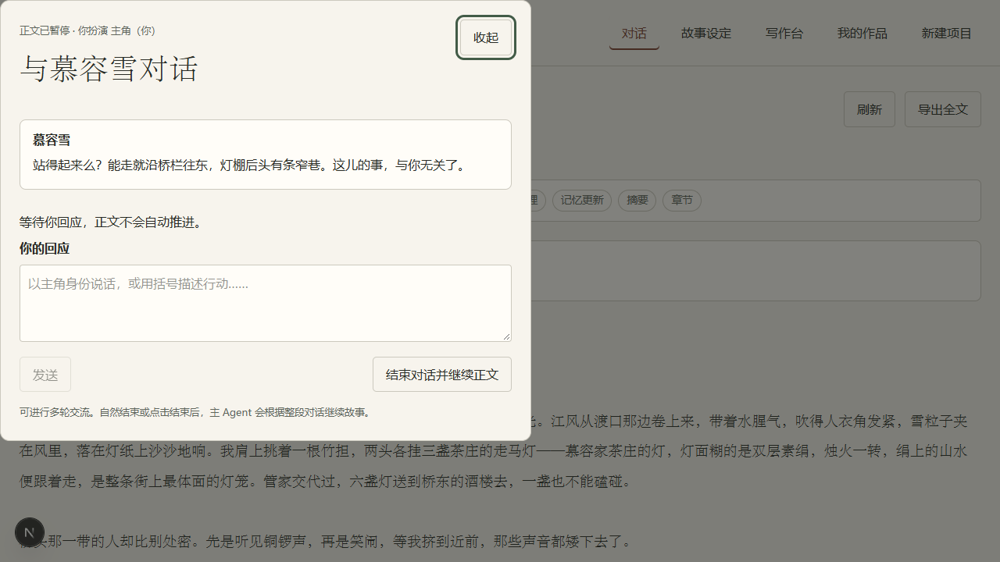

# 书中人

<p align="center">
  
</p>

<h3 align="center">这段旅程，我和你一起完成。我们都是故事中的主角。</h3>

<p align="center">
  一个和 AI 一起写中文故事的共创工作台
</p>

书中人不是让 AI 替你把故事一次写完，而是给你一张可以反复回来的书桌。

你可以从一句话开始：一个人、一段旅程，或者一个“如果……”。书中人会陪你把它慢慢长成一个有世界、有来处、有人情关系的故事。你始终掌握主角的选择，AI 负责让世界回应你、让人物记得发生过什么，也在恰当的时候停下来，等你亲自回答。

## 产品展示

### 对话式写作：故事会等你做决定

<p align="center">
  
</p>

故事写到关键处，人物会来到你面前。你可以用主角的身份说一句对白，也可以描述一个行动；你的回应会成为后续剧情的一部分。

### 世界时间线：让故事有来处，也有迹可循

<p align="center">
  
</p>

历史、人物前史和开局事件会留在同一条时间线上。故事越写越长，也能随时回头查看、补充和整理。

## 你可以在这里做什么

- 从一个模糊的念头开始，让 AI 帮你搭出世界、人物和开局。
- 直接编辑故事设定，不喜欢的内容可以改，不需要接受一份“写死”的结果。
- 让人物带着自己的身份、关系、动机和记忆进入剧情。
- 在关键停点亲自回应，让你的选择真正改变故事的方向。
- 随时查看世界时间线、人物记忆和章节，把灵感整理成一部完整作品。
- 保存、恢复并导出作品，下一次回来时接着写。

## 一次完整的创作体验

1. 写下你的故事想法，选择一个东方武侠或西方魔幻的起点。
2. 让书中人先生成世界框架、人物和开场；你可以边看边改。
3. 进入故事，用自己的话说行动、对白和选择。
4. 当人物向你发问时，以主角身份回应，继续把故事往前推。
5. 回到设定和时间线，整理已经发生的事，再写下一章。

> 你不需要先想好整本书。先写下第一句话，剩下的路一起走。

## 在本地体验

项目目前是本地运行的 Next.js 应用。

### 一键启动

双击根目录的 `start.py`，或在 PowerShell 中运行：

```powershell
python start.py
```

脚本会检查依赖、启动服务，并在 <http://127.0.0.1:3000> 就绪后打开浏览器。

### 手动启动

```powershell
npm ci
npm run dev
```

然后访问 <http://127.0.0.1:3000>。

如需使用真实模型，请在项目根目录创建本地 `.env.local`，参考 `.env.example` 填写：

```text
LLM_BASE_URL=你的 OpenAI 兼容服务地址
LLM_MODEL=你的文本模型名称
LLM_API_KEY=只保存在本机的密钥
```

密钥只保存在本机，不要放进前端、截图、README 或 GitHub。仓库中的 `examples/demo-wuxia-input.md` 提供了一份可以直接粘贴体验的武侠开场输入。

## 当前状态

这是一个正在打磨中的本地产品原型。目前已经可以体验故事创建、世界与人物共创、对话式写作、人物互动、记忆与时间线整理、刷新恢复和作品导出。

真实模型的内容质量、响应速度和可用性取决于本地配置的模型服务。当前尚未提供账号系统、云端同步或公网部署。

<details>
<summary>开发者信息</summary>

### 技术栈

Next.js App Router、React、TypeScript、Tailwind CSS、Ajv JSON Schema，以及服务端主 Agent 编排。故事世界、人物画像和时间线使用共享契约保存，写作过程保留可恢复的检查点。

### 开发检查

```powershell
npm run lint
npm run typecheck
npm test
npm run schemas:check
npm run build
```

### 项目文档

- [完整产品需求](PRD.md)
- [主 Agent 调用契约](MAIN_AGENT_RULES.md)
- [第一层功能规格](docs/PRODUCT_SPEC.md)
- [演示输入](examples/demo-wuxia-input.md)
- [当前开发状态](memory/CURRENT.md)

</details>

## License

当前项目用于产品原型与开发展示，授权方式待补充。

