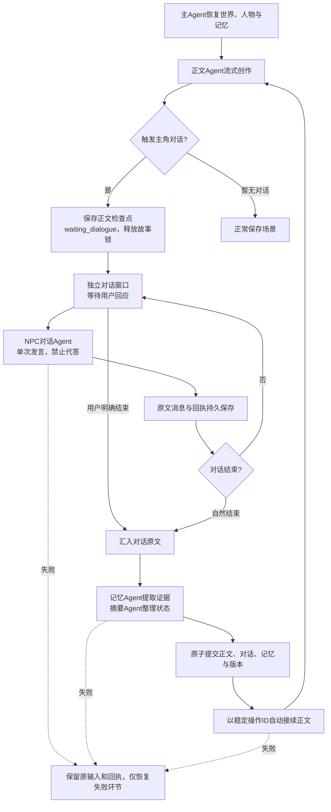

# NPC 对话 Agent 与主流程

权威调用规则见根目录 MAIN_AGENT_RULES.md。本设计实现 `dialogue_v2`，替代“完成整轮后才显示一个回应框”的体验。

## 用户流程

正文流式生成到NPC向主角发起对话的位置，保存正文检查点，立即暂停并打开独立对话窗口。此时尚未调用记忆抽取和摘要，也不自动替用户回答。

用户可与NPC连续交流；每个回复仅调用一次NPC对话Agent，传入场景、角色设定、动态记忆与完整交流记录。NPC自然结束对话，或用户点击“结束对话并继续正文”后，主Agent才整理完整记录、更新记忆和摘要，并自动续写至下一对话停点。收起窗口只影响显示。

## Agent职责

| 组件 | 输入 | 输出与权限 |
| --- | --- | --- |
| 主Agent | 故事状态、命令与版本 | 路由、锁、检查点、提交、自动接续；唯一权威写入者 |
| 正文Agent | 背景、人物、最近正文和记忆 | 正文与结构化对话停点；不能越过问话代主角决定 |
| NPC对话Agent | 指定NPC/主角、停点正文、动态记忆、消息记录 | `{utterance, finished}`，仅当前NPC发言；不生成续篇 |
| 状态记录工具 | 用户原文、NPC原文和操作回执 | 确定性消息记录；不自行推断用户承诺 |
| 记忆与摘要Agent | 停点之前正文及完整对话原文 | 带来源的事实、人物状态与摘要；说法不能升级为客观事实 |

实现入口：`src/lib/orchestration/npc-dialogue.ts`。模型适配为 `NarrativeAgents.npcDialogue`，由主Agent调度；不需要另开服务或额外配置密钥。

## 状态和恢复

- `active`：对话等待用户。父轮次为`waiting_dialogue`，不占用故事锁，不生成正文。
- `ready`：对话已结束，等待记忆/摘要及提交。
- `closed`：父轮次已提交，通过持久`continuation_id`自动接续下一轮。
- `abandoned`：明确放弃，对话与输入保留审计，不继续调用。

对话命令经 `/api/story/tasks` 提交，包含 `dialogue_action`（reply或finish）、`dialogue_id`、`dialogue_revision`、故事版本、操作ID和输入。版本过期、重复ID承载不同内容、未完成的上一条消息均拒绝；成功回放不新增模型调用。

NPC模型结果先单独保存，随后提交消息。程序在两次保存之间中断时复用已保存结果。对话提交与下一正文之间中断时，用已落盘的接续ID恢复。下一次对话使用新的会话ID，上一对话的结束操作不能重复启动新场景。

刷新恢复弹窗和草稿；完整备份保留对话和已验证的暂停正文。导入时清理不可信的未完成下游检查点，重新构建记忆；不会无条件执行备份中的运行状态。

## 验证边界

`tests/npc-dialogue-agent.test.ts`覆盖多轮交流、连续两次自动接续、旧请求回放、NPC失败、摘要失败、保存失败、提交后中断以及活动对话备份。

浏览器`test:e2e`验证正文仅调用一次即弹窗、两次交流只调用NPC、刷新零调用、收起不结束、明确结束后自动续写并再次弹窗。

真实对话语义取决于模型，不能承诺永不误判；失败会保留状态供恢复，不通过自动编造用户回应来维持循环。没有NPC对话的场景正常保存；用户仍可推进下一场景。服务为本机单进程，未宣称分布式高可用。

## 本轮验证记录（2026-09-13）

- 144项离线测试、Lint/类型/生产构建PASS，浏览器21次合成调用通过连续自动接续。
- 两轮真实NPC初验出现非JSON返回，触发2次修复，并编造了未提供的细节；原始错误保留于runtime/dialogue-evaluation/1789230903174。
- NPC专用请求启用JSON模式并加强知识边界后，两轮复验无需修复，耗时5089ms与3860ms，finished均false。记录在runtime/dialogue-evaluation/1789231089268。
- 实际模型仍会补写未设定细节，语义验收仅PARTIAL，不能宣称已消除幻觉。对话原文匹配的证据若被标为旁白/身份确认，会在投影前确定性降为character_statement；保留原文和原始抽取回执，不把新增说法直接提升为客观历史。未匹配的复杂转述与推断仍需进一步语义评审。
- 两次真实验收共6次调用（初验4、复验2），均使用独立合成故事，没有改动用户小说。未宣称已完成真实长篇全链路验收。

### 对话驱动生成（2026-09-13）
开场以短场景引出NPC交流，不以写完场景为目标。用户决定主角对白、承诺与关键动作，NPC提醒/委托等需要表态的台词同样触发停点。文本校验拦截明显遗漏与已知主角代言，交由现有一次修复；不将规则通过视为语义完整正确。独处可短过渡，完整故事通过多轮互动展开。
